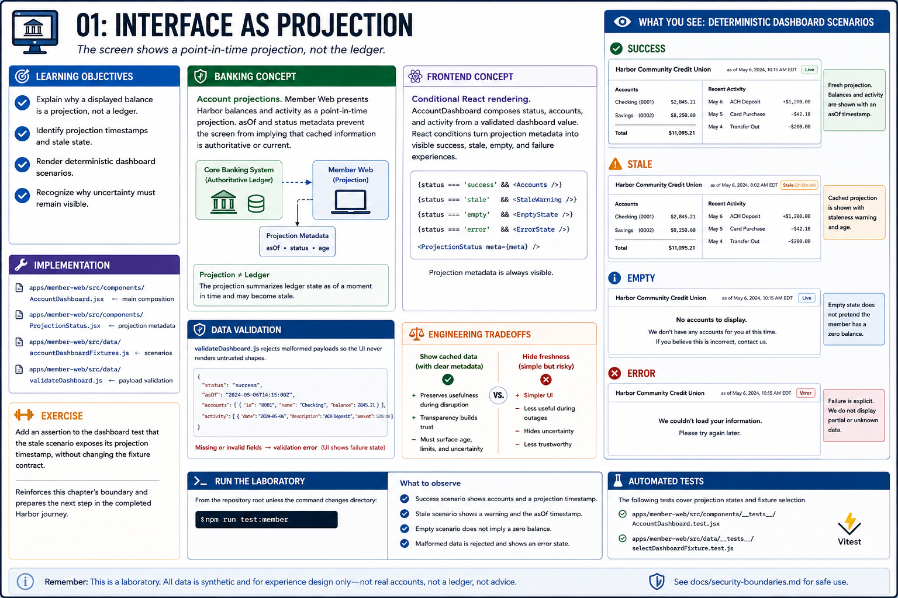

# 01: Interface as projection

## Learning objectives

- Explain why a displayed balance is a projection, not a ledger.
- Identify projection timestamps and stale state.
- Render deterministic dashboard scenarios.
- Recognize why uncertainty must remain visible.



## Banking concept

**Account projections.** Member Web presents Harbor balances and activity as a point-in-time projection. `asOf` and status metadata prevent the screen from implying that cached information is authoritative or current.

## Frontend concept

**Conditional React rendering.** `AccountDashboard` composes status, accounts, and activity from a validated dashboard value. React conditions turn projection metadata into visible success, stale, empty, and failure experiences.

## Implementation

`apps/member-web/src/components/AccountDashboard.jsx`, `ProjectionStatus.jsx`, and `data/accountDashboardFixtures.js` implement the projection. `data/validateDashboard.js` rejects malformed payloads.

## Run the laboratory

From the repository root unless the command changes directory:

```bash
npm run test:member
```

## What to observe

The success scenario shows accounts and a projection timestamp; stale shows a warning; empty does not pretend the member has a zero balance; malformed data is rejected.

## Engineering tradeoffs

Showing cached data can preserve usefulness during disruption, but only when its age and limitations are explicit. Hiding freshness is simpler and less trustworthy.

## Automated tests

`AccountDashboard.test.jsx` and `selectDashboardFixture.test.js` cover projection states and fixture selection.

## Exercise

Add an assertion to the dashboard test that the stale scenario exposes its projection timestamp, without changing the fixture contract.

The exercise reinforces this chapter's boundary and prepares the next step in the completed Harbor journey.
