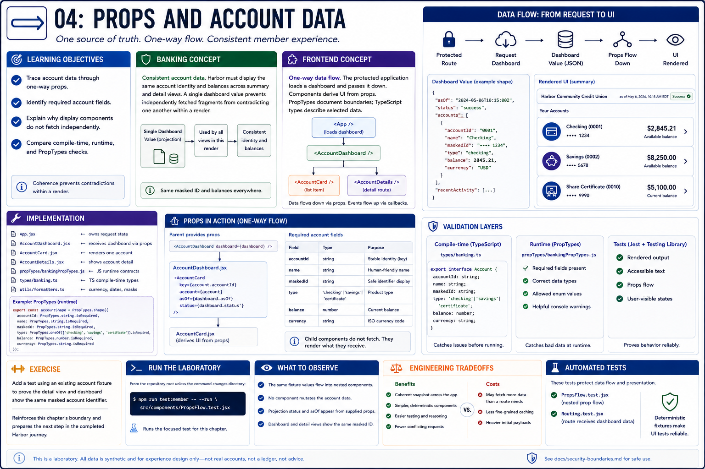

# 04: Props and account data

## Learning objectives

- Trace account data through one-way props.
- Identify required account fields.
- Explain why display components do not fetch independently.
- Compare compile-time, runtime, and PropTypes checks.



## Banking concept

**Consistent account data.** Harbor must display the same account identity and balances across summary and detail views. A single dashboard value prevents independently fetched fragments from contradicting one another within a render.

## Frontend concept

**One-way data flow.** The protected application loads a dashboard and passes it into route components. Components derive UI from props; PropTypes document JavaScript boundaries while selected TypeScript types describe migrated data.

## Implementation

`App.jsx` owns request state. `AccountDashboard.jsx`, `AccountDetails.jsx`, and `propTypes/bankingPropTypes.js` consume the value. `types/banking.ts` defines selected static contracts.

## Run the laboratory

From the repository root unless the command changes directory:

```bash
npm run test:member -- --run src/components/PropsFlow.test.jsx
```

## What to observe

The same fixture values flow into nested components without mutation, and conditional metadata appears from the supplied props.

## Engineering tradeoffs

Centralized loading gives a coherent snapshot and simpler components, but can fetch more data than one route needs. For this deterministic laboratory, coherence is more valuable than fine-grained caching.

## Automated tests

`PropsFlow.test.jsx` verifies nested prop flow; `Routing.test.jsx` verifies dashboard data reaches account routes.

## Exercise

Add a test using an existing account fixture to prove the detail view and dashboard show the same masked account identifier.

The exercise reinforces this chapter's boundary and prepares the next step in the completed Harbor journey.
