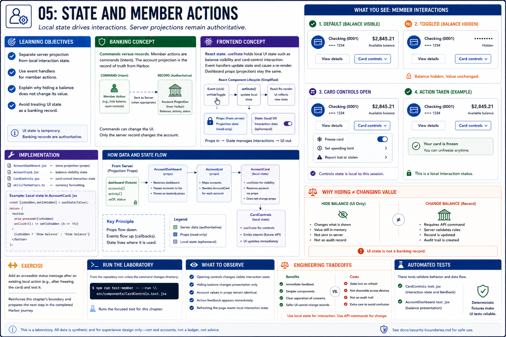

# 05: State and member actions

## Learning objectives

- Separate server projection from local interaction state.
- Use event handlers for member actions.
- Explain why hiding a balance does not change its value.
- Avoid treating UI state as a banking record.



## Banking concept

**Commands versus records.** A member can hide balances or open card controls, but those interactions do not alter Harbor's underlying account projection. A command intent and an authoritative record are different things.

## Frontend concept

**React state.** Local `useState` values control disclosure and card-control interaction. Events update local state and React re-renders; dashboard props remain unchanged.

## Implementation

`AccountCard.jsx` implements balance visibility and `CardControls.jsx` implements the card-control interaction. `AccountDashboard.jsx` continues to own projected data.

## Run the laboratory

From the repository root unless the command changes directory:

```bash
npm run test:member -- --run src/components/CardControls.test.jsx
```

## What to observe

Activating controls changes the visible interaction state. Toggling balance visibility changes presentation without changing fixture data.

## Engineering tradeoffs

Local state provides immediate feedback but disappears on refresh and is not an audit record. Persistent banking changes require an authenticated API command and server-side history.

## Automated tests

`CardControls.test.jsx` checks member actions; `AccountDashboard.test.jsx` covers balance presentation.

## Exercise

Add an accessible status message after an existing local action and test it without adding a new API behavior.

The exercise reinforces this chapter's boundary and prepares the next step in the completed Harbor journey.
