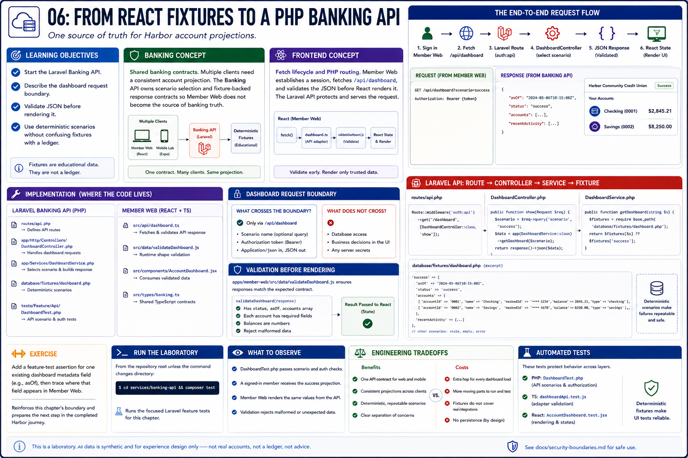

# 06: From React fixtures to a PHP Banking API

## Learning objectives

- Start the Laravel Banking API.
- Describe the dashboard request boundary.
- Validate JSON before rendering it.
- Use deterministic scenarios without confusing fixtures with a ledger.



## Banking concept

**Shared banking contracts.** Multiple clients need a consistent account projection. The Banking API owns scenario selection and fixture-backed response contracts so Member Web does not become the source of banking truth.

## Frontend concept

**Fetch lifecycle and PHP routing.** Member Web fetches `/api/dashboard` after session establishment. Laravel routes the protected request to `DashboardController`; the TypeScript API adapter validates the response before React receives it.

## Implementation

`services/banking-api/routes/api.php`, `DashboardController.php`, and `fixtures/dashboard.php` produce responses. `apps/member-web/src/api/dashboard.ts` and `data/validateDashboard.js` consume them.

## Run the laboratory

From the repository root unless the command changes directory:

```bash
cd services/banking-api && composer test
```

## What to observe

`DashboardTest.php` reports passing scenario and authorization cases. With the API and Member Web running, a signed-in member receives the success projection.

## Engineering tradeoffs

A shared API contract enables browser and mobile consistency. Deterministic fixtures make failure modes repeatable, but they deliberately omit persistence and real integration behavior.

## Automated tests

`DashboardTest.php` validates API scenarios; `dashboardApi.test.js` covers the Mobile Laboratory adapter; Member Web dashboard tests cover rendering.

## Exercise

Add a feature-test assertion for one existing dashboard metadata field, then trace it to the corresponding Member Web component.

The exercise reinforces this chapter's boundary and prepares the next step in the completed Harbor journey.
