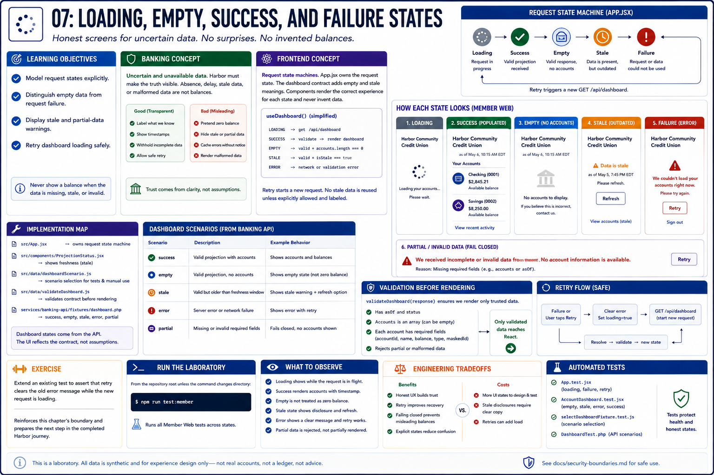

# 07: Loading, empty, success, and failure states

## Learning objectives

- Model request states explicitly.
- Distinguish empty data from request failure.
- Display stale and partial-data warnings.
- Retry dashboard loading safely.



## Banking concept

**Uncertain and unavailable data.** Banking screens must not turn absence, delay, or malformed data into a balance. Harbor labels stale information and withholds incomplete projections.

## Frontend concept

**Request state machines.** `App.jsx` moves through loading, success, and error states; the dashboard contract adds empty and stale meanings. Retry starts a new GET without inventing cached data.

## Implementation

`apps/member-web/src/App.jsx`, `ProjectionStatus.jsx`, `data/dashboardScenario.js`, and `validateDashboard.js` implement the states. Banking API dashboard fixtures provide `success`, `empty`, `stale`, `error`, and `partial`.

## Run the laboratory

From the repository root unless the command changes directory:

```bash
npm run test:member
```

## What to observe

Tests show a loading message, populated and empty experiences, stale disclosure, an error screen, and a retry path. Partial data fails validation rather than rendering misleading balances.

## Engineering tradeoffs

Retrying a read is low risk and improves recovery; retaining stale data can also help. Both choices require honest labels, and malformed financial data should fail closed.

## Automated tests

`App.test.jsx`, `AccountDashboard.test.jsx`, and `selectDashboardFixture.test.js` cover request and projection states; `DashboardTest.php` covers API scenarios.

## Exercise

Extend an existing test to assert that retry clears the old error message while the new request is loading.

The exercise reinforces this chapter's boundary and prepares the next step in the completed Harbor journey.
