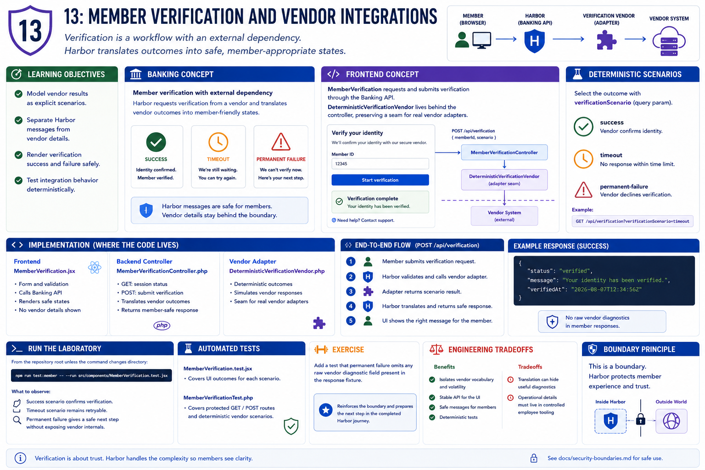

# 13: Member verification and vendor integrations

## Learning objectives

- Model vendor results as explicit scenarios.
- Separate Harbor messages from vendor details.
- Render verification success and failure safely.
- Test integration behavior deterministically.



## Banking concept

**Member verification.** Verification is a workflow with an external dependency, not a simple boolean. Harbor translates success, timeout, and permanent failure into member-appropriate states.

## Frontend concept

**Integration adapters.** `MemberVerification` requests and submits verification through the Banking API. `DeterministicVerificationVendor` stands behind the controller, preserving a seam where a real vendor adapter would live.

## Implementation

`MemberVerification.jsx`, `MemberVerificationController.php`, and `DeterministicVerificationVendor.php` implement the workflow. The query parameter `verificationScenario` selects a deterministic result.

## Run the laboratory

From the repository root unless the command changes directory:

```bash
npm run test:member -- --run src/components/MemberVerification.test.jsx
```

## What to observe

The success scenario confirms verification; timeout remains retryable; permanent failure gives a safe next step without exposing vendor internals.

## Engineering tradeoffs

An adapter isolates vendor vocabulary and volatility, but translation can hide useful diagnostics. Member messages stay safe while operational details belong in controlled employee tooling.

## Automated tests

`MemberVerification.test.jsx` covers UI outcomes; `MemberVerificationTest.php` covers protected GET/POST routes and deterministic vendor scenarios.

## Exercise

Add a test that permanent failure omits any raw vendor diagnostic field present in the response fixture.

The exercise reinforces this chapter's boundary and prepares the next step in the completed Harbor journey.
