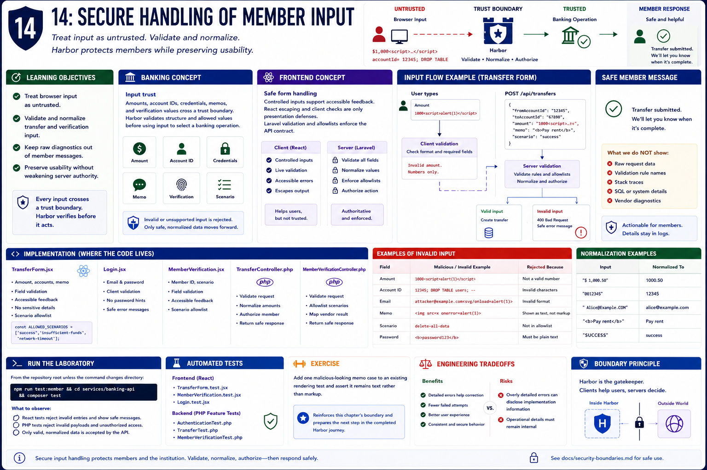

# 14: Secure handling of member input

## Learning objectives

- Treat browser input as untrusted.
- Validate and normalize transfer and verification input.
- Keep raw diagnostics out of member messages.
- Preserve usability without weakening server authority.



## Banking concept

**Input trust.** Amounts, account IDs, credentials, memos, and verification values cross a trust boundary. Harbor validates structure and allowed values before using an input to select a banking operation.

## Frontend concept

**Safe form handling.** Controlled inputs support accessible feedback, but React escaping and client checks are only presentation defenses. Laravel request validation and explicit scenario allowlists enforce the API contract.

## Implementation

`TransferForm.jsx`, `Login.jsx`, `MemberVerification.jsx`, `TransferController.php`, and `MemberVerificationController.php` contain the relevant input boundaries.

## Run the laboratory

From the repository root unless the command changes directory:

```bash
npm run test:member && cd services/banking-api && composer test
```

## What to observe

Client suites reject invalid entries and render safe messages; PHP feature tests reject invalid payloads and unsupported access without trusting the browser.

## Engineering tradeoffs

Detailed errors help correction but may disclose implementation information. Harbor provides actionable member language and retains technical detail only where an authorized operational context needs it.

## Automated tests

`TransferForm.test.jsx`, `MemberVerification.test.jsx`, `AuthenticationTest.php`, `TransferTest.php`, and `MemberVerificationTest.php` cover these boundaries.

## Exercise

Add one malicious-looking memo case to an existing rendering test and assert it remains text rather than markup.

The exercise reinforces this chapter's boundary and prepares the next step in the completed Harbor journey.
