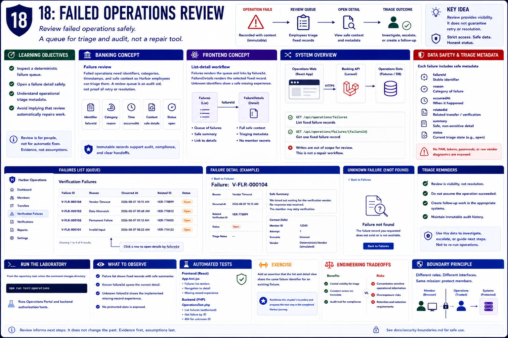

# 18: Failed operations review

## Learning objectives

- Inspect a deterministic failure queue.
- Open a failure detail safely.
- Understand operational triage metadata.
- Avoid implying that review automatically repairs work.



## Banking concept

**Failure review.** Failed operations need identifiers, categories, timestamps, and safe context so Harbor employees can triage them. A review queue is an audit aid, not proof of retry or resolution.

## Frontend concept

**List-detail workflow.** `Failures` renders the queue and links by `failureId`; `FailureDetails` renders the selected fixed record. The Banking API exposes matching collection and detail routes.

## Implementation

`apps/operations-web/src/components/Failures.jsx`, `FailureDetails.jsx`, `data/operationsFixtures.js`, and the Banking API `Operations/FailureController.php` implement review.

## Run the laboratory

From the repository root unless the command changes directory:

```bash
npm run test:operations
```

## What to observe

The failure list shows fixed cases, a known identifier opens details, and an unknown identifier produces the implemented safe missing-record experience.

## Engineering tradeoffs

Central review improves visibility but concentrates sensitive information. Production tooling needs strict access, redaction, retention, and immutable audit history beyond this fixture-backed example.

## Automated tests

`apps/operations-web/src/App.test.jsx` validates failure list and detail behavior; `OperationsTest.php` validates `/api/operations/failures` routes.

## Exercise

Add an assertion that the list and detail view share the same failure identifier for an existing fixture.

The exercise reinforces this chapter's boundary and prepares the next step in the completed Harbor journey.
