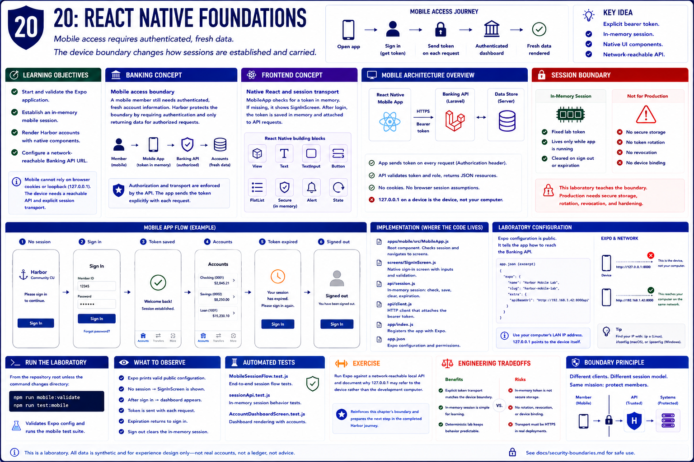

# 20: React Native foundations

## Learning objectives

- Start and validate the Expo application.
- Establish an in-memory mobile session.
- Render Harbor accounts with native components.
- Configure a network-reachable Banking API URL.



## Banking concept

**Mobile access boundary.** A mobile member still needs authenticated, fresh account information, but the device cannot assume browser cookie persistence or a loopback address that reaches the development computer.

## Frontend concept

**Native React and session transport.** `MobileApp` composes native screens with `View`, `Text`, and accessible controls. It checks an in-memory laboratory bearer token, shows `SignInScreen` when absent, and sends the token explicitly after login.

## Implementation

`apps/mobile/src/MobileApp.js`, `screens/SignInScreen.js`, `api/session.js`, `api/client.js`, and `app/index.js` establish the Mobile Laboratory. `app.json` supplies Expo configuration.

## Run the laboratory

From the repository root unless the command changes directory:

```bash
npm run mobile:validate && npm run test:mobile
```

## What to observe

Expo prints valid public configuration. Tests show session checking, native sign-in, authenticated dashboard entry, expiration, and sign-out without relying on browser cookies.

## Engineering tradeoffs

Explicit bearer transport fits the teaching device boundary, but an in-memory fixed token is not production credential storage. Real mobile software needs secure storage, token rotation, revocation, and transport hardening.

## Automated tests

`MobileSessionFlow.test.js`, `sessionApi.test.js`, and `AccountDashboardScreen.test.js` validate foundations and session behavior.

## Exercise

Run Expo against a network-reachable local API and document why `127.0.0.1` may refer to the device rather than the development computer.

The exercise reinforces this chapter's boundary and prepares the next step in the completed Harbor journey.
