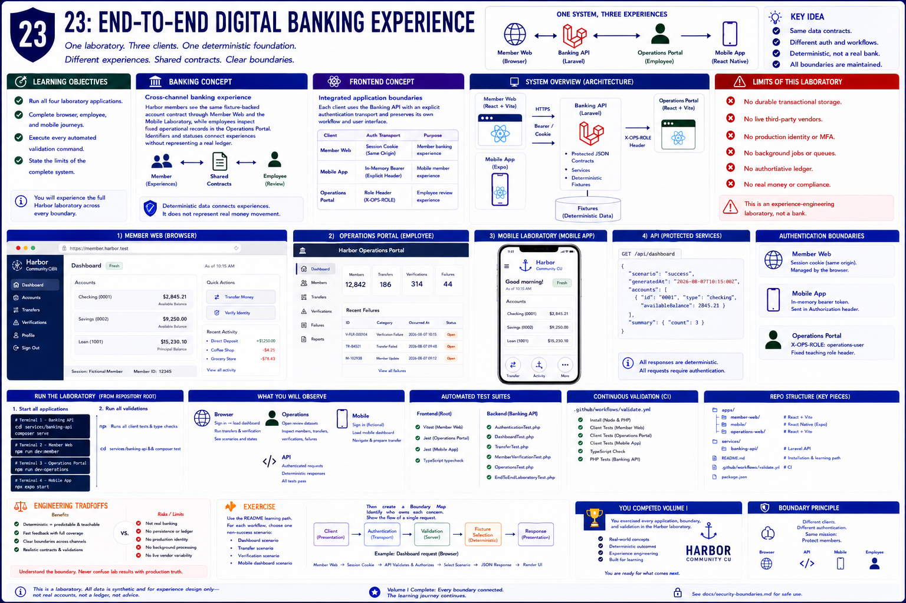

# 23: End-to-end digital banking experience

## Learning objectives

- Run all four laboratory applications.
- Complete browser, employee, and mobile journeys.
- Execute every automated validation command.
- State the limits of the complete system.



## Banking concept

**Cross-channel banking experience.** Harbor members see the same fixture-backed account contract through Member Web and the Mobile Laboratory, while employees inspect fixed operational records in the Operations Portal. Identifiers and statuses connect experiences without representing a real ledger.

## Frontend concept

**Integrated application boundaries.** Laravel owns protected JSON contracts and deterministic services. Member Web uses a session cookie, mobile uses an in-memory bearer value, and the Operations Portal uses a fixed teaching role header through its adapter. Each client preserves its own workflow.

## Implementation

The full implementation lives in `apps/member-web`, `apps/mobile`, `apps/operations-web`, and `services/banking-api`. `README.md` provides installation and startup; `.github/workflows/validate.yml` records continuous validation.

## Run the laboratory

From the repository root unless the command changes directory:

```bash
npm run verify && cd services/banking-api && composer test
```

## What to observe

Member Web signs in and loads projections, transfer and verification scenarios reproduce, Operations Portal opens its review datasets, mobile signs in and loads its dashboard, and all client and API checks pass.

## Engineering tradeoffs

Determinism makes every outcome teachable and fast, but omits durable storage, live vendors, secure production identity, background processing, and an authoritative ledger. The completed volume is an experience-engineering laboratory, not a bank.

## Automated tests

Root Vitest and Jest suites cover all three clients. `AuthenticationTest.php`, `DashboardTest.php`, `TransferTest.php`, `MemberVerificationTest.php`, `OperationsTest.php`, and `EndToEndLaboratoryTest.php` cover the Banking API.

## Exercise

Perform the README learning path using one non-success scenario in each applicable workflow, then write a short boundary map showing which layer owns authentication, validation, presentation, and fixture selection.

This chapter completes Volume I by connecting every established boundary.
